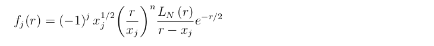
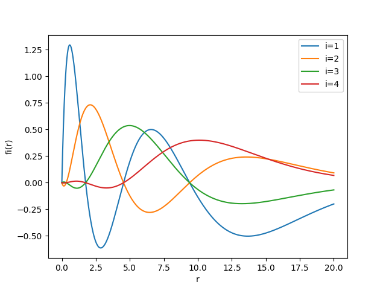
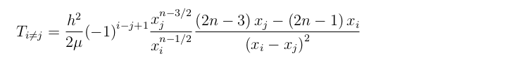
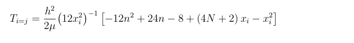
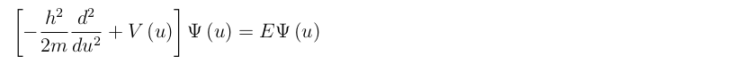
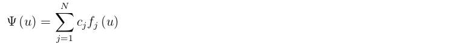
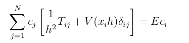

# Hydrogen-atom

## Regulazed Laguerre functions
The Regulazed Laguerre functions are defined in the interval (0,inf) as:

The picture below shows the Regulazed Lagrange-Laguerre functions for N=4 and n=1. Basis functions fi(r) are plotted for i=1,2,3 and 4.

LN(r) is a Laguerre polynomial of order N and the mesh points xj are the zeros of this polynomial. The kinetic-matrix elements at the Gauss approximation read

The Schrödinger equation can be written as:

It was decided to take u=xh and expand the wave function on the scaled-Lagrange basis defined in the interval (ha,hb) as

Then the wave equation is inserted in the Schrödinger equation and taking the properties of Gauss Quadrature, we end up with :

The expression above is a matrix so we can get information from it if we diagonalizate it. We can get eigenvalues which are the energies and the respecting eigenvector. After that, we can construct the wave function.

I constructed a program in python that diagonalizate the matrix, find thw wave function and then plot the probability density function (Laguerre-probability-density-function.py).

